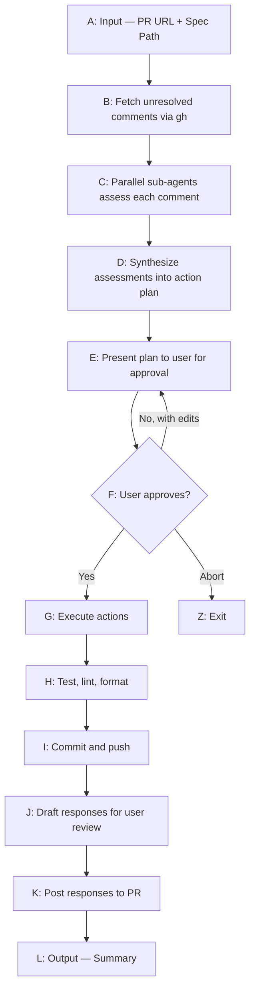

# PR Review Handler

Systematically processes PR review comments: assesses each piece of feedback, creates a coherent action plan, implements changes, and responds to reviewers.

---

## Flow



---

## Input

- **PR URL**: GitHub PR URL (e.g., `https://github.com/org/repo/pull/123`)
- **Spec file path**: Path to the spec being implemented (provides intent context)

---

## Step 1: Fetch Comments

Use `gh` CLI to fetch all unresolved review comments:

```bash
# Fetch PR metadata and top-level comments
gh pr view [PR_NUMBER] --json reviews,comments,state,headRefName

# Fetch review comment threads (inline code comments) via the API
gh api repos/{owner}/{repo}/pulls/{pr_number}/comments --paginate
```

The first command gets PR-level reviews and general comments. The second command returns all review comments (inline code comments on specific lines), which include `in_reply_to_id` fields to reconstruct threads.

For each comment thread, capture:
- Comment ID (needed for posting replies)
- File path and line number(s) (`path`, `line`, `original_line`)
- Full thread history (group by `in_reply_to_id` to reconstruct threads)
- Author (`user.login`)
- Whether it's part of a "request changes" review (check `reviews` from the first command)

---

## Step 2: Parallel Assessment

Spawn a sub-agent for each comment thread. Each sub-agent receives:
- The comment thread (full context)
- The relevant code snippet
- The spec file (for understanding intent)
- Other comments on the same file (for awareness)

### Assessment Output

Each sub-agent returns one of:

**1. Needs Action**
```yaml
assessment: needs-action
summary: "Reviewer is right — we're not handling the null case"
suggested_fix: "Add null check before accessing user.profile"
file: "src/components/UserCard.tsx"
lines: [42, 45]
effort: trivial | small | medium  # helps prioritize
```

**2. Needs Discussion**
```yaml
assessment: needs-discussion
summary: "Reviewer suggests Redux but spec explicitly chose Zustand"
reason: "unclear" | "disagrees-with-spec" | "out-of-scope" | "subjective"
suggested_response: "The spec chose Zustand for X reason. Happy to discuss if you feel strongly."
```

**3. Already Resolved**
```yaml
assessment: already-resolved
summary: "This was fixed in a subsequent commit"
evidence: "Commit abc123 added the missing validation"
suggested_response: "Addressed in abc123 — added validation for empty arrays."
```

---

## Step 3: Synthesize Action Plan

A single agent reviews all assessments to create a coherent plan. This is critical because:
- Multiple comments may affect the same code
- Reviewer suggestions may conflict with each other
- Changes need to be atomic and not break each other

### Conflict Detection

Identify and flag:
- **Same-code conflicts**: Two comments suggest different changes to the same lines
- **Reviewer disagreements**: Reviewer A says X, Reviewer B says Y
- **Spec conflicts**: Suggestion contradicts spec intent

### Plan Format

```markdown
## PR Review Action Plan

**PR**: #123 — Feature X
**Comments**: 8 total (5 need action, 2 need discussion, 1 already resolved)

### Actions (in execution order)

- [ ] **Action 1**: Add null check in UserCard.tsx:42
      Comment by @reviewer1 — "Missing null safety"
      Effort: trivial
      
- [ ] **Action 2**: Extract validation logic to shared util
      Comment by @reviewer2 — "This pattern is duplicated"
      Effort: small
      Related: Also addresses @reviewer1's comment on line 87

### Discussions (need your input)

- [ ] **Discussion 1**: Redux vs Zustand
      @reviewer3 suggests switching to Redux
      Spec explicitly chose Zustand (see Architecture section)
      **Draft response**: "We went with Zustand per the spec because..."
      **Your call**: Respond as drafted / Modify / Actually switch

### Conflicts Detected

- **Lines 50-55 of api.ts**: @reviewer1 wants try/catch, @reviewer2 wants Result type
  **Recommendation**: Use Result type (cleaner, matches spec's error handling approach)
  **Your call**: Result type / Try-catch / Discuss with reviewers

### Already Resolved

- @reviewer1's comment on missing tests — addressed in commit abc123
```

---

## Step 4: User Approval

Present the plan and wait for user input:

- **Approve all**: Proceed with plan as-is
- **Edit**: User modifies checkboxes, draft responses, or conflict resolutions
- **Abort**: Exit without changes

User can also add notes like "skip action 2 for now" or "change the response tone."

---

## Step 5: Execute Actions

For each approved action:

1. Make the code change
2. Verify change doesn't break related code
3. Track what was changed for commit message

Execute in dependency order if actions are related.

---

## Step 6: Quality Checks

For each service/app that was modified:

```bash
# Run in each affected service directory
npm run lint --fix  # or equivalent
npm run format      # or equivalent  
npm run test        # run affected tests
```

If checks fail:
- Attempt auto-fix for lint/format issues
- For test failures, pause and notify user

---

## Step 7: Commit and Push

### Commit Message Format

```
address PR review feedback (#123)

Actions taken:
- Add null check in UserCard.tsx
- Extract validation to shared util
- Fix typo in error message

Resolves review comments from: @reviewer1, @reviewer2
```

### Push

```bash
git push origin [branch-name]
```

---

## Step 8: Post Responses

### Response Prefix

All responses start with:
```
🤖 *Addressed via Claude Code*

```

### Draft Review Before Posting

Show user all drafted responses before posting:

```markdown
## Responses to Post

**Thread 1** (@reviewer1 on UserCard.tsx:42):
> 🤖 *Addressed via Claude Code*
> 
> Good catch! Added null check — see latest commit.

**Thread 2** (@reviewer3 on architecture):
> 🤖 *Addressed via Claude Code*
> 
> We went with Zustand per the spec's architecture decision (see spec section 3.2). 
> The main drivers were bundle size and simpler mental model for this use case.
> Happy to discuss further if you have concerns!

[ Post All ] [ Edit ] [ Cancel ]
```

### Posting

Use `gh` CLI to respond to threads. **Important**: Use the correct command based on comment type:

**For review comment threads (most common)** — replies to inline code comments:
```bash
gh api repos/{owner}/{repo}/pulls/{pr}/comments/{comment_id}/replies -f body="[response]"
```

**For top-level PR comments only** — general discussion not tied to specific code:
```bash
gh pr comment [PR_NUMBER] --body "[response]"
```

Since this skill processes review comments on specific code lines, you will almost always use the first command (API endpoint for thread replies). Using `gh pr comment` for review thread responses will incorrectly post to the main PR conversation instead of the thread.

---

## Output Summary

```markdown
## ✅ PR Review Handling Complete

**PR**: #123 — Feature X
**Branch**: feature/ENG-1234-user-ratings-feed

### Actions Completed
- ✅ Add null check in UserCard.tsx
- ✅ Extract validation to shared util
- ⏭️ Skipped: Redux migration (per user decision)

### Quality Checks
- ✅ Lint passed
- ✅ Format passed
- ✅ Tests passed (23 tests, 2 snapshots updated)

### Commit
`abc123` — "address PR review feedback (#123)"

### Responses Posted
- ✅ 5 comment threads responded to
- 📝 1 discussion pending (Redux vs Zustand — awaiting reviewer reply)

### Remaining
- 2 comments marked as won't-fix (per user decision)
```

---

## Configuration

| Option | Default | Description |
|--------|---------|-------------|
| `autoResolveThreads` | false | Automatically resolve threads after responding |
| `commitStrategy` | single | `single` (one commit) or `per-action` |
| `requireApproval` | true | Always require user approval before acting |
| `responsePrefix` | "🤖 *Addressed via Claude Code*" | Prefix for all PR responses |

---

## Edge Cases

### No unresolved comments
Exit early with "No unresolved comments found on this PR."

### PR is merged
Exit with "PR is already merged. Comments cannot be addressed."

### Branch conflicts
Notify user: "Branch has conflicts with base. Please resolve before addressing comments."

### Rate limiting
If `gh` rate limits, pause and notify user with retry time.