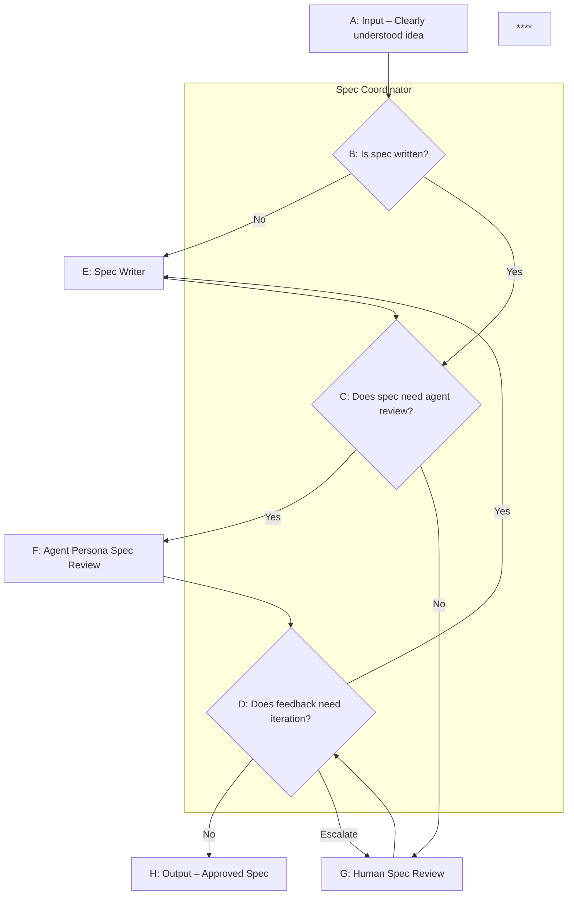

# Spec Orchestrator

Coordinates the full lifecycle of specification development: writing, multi-agent review, revision, and approval. Simulates diverse team perspectives during review and iterates until the spec is approved or escalated to the user.

Supports two modes:

1. **Full loop**: Write spec → review → revise → re-review until approved
2. **Review only**: Review an existing spec and provide feedback

---

## Flow



**Key points:**
- H (Approved) is the only exit
- Escalation routes to Human Review (G), not an exit—humans unblock, then iteration continues
- Simple specs skip agent review entirely (C → G)

---

## State

Track across iterations:

```
{
  iteration: 0,
  maxIterations: 3,
  status: "drafting" | "awaiting-review" | "in-review" | "approved",
  spec: null,
  reviewPath: "agent" | "human" | null,
  originalRequest: string,
  history: [{ iteration, feedback, reviewer }],
  escalationCount: 0
}
```

---

## Coordinator Decisions

### B: Is spec written?

- **No** → Route to Spec Writer (E)
- **Yes** → Evaluate if agent review needed (C)

### C: Does spec need agent review?

Classify the spec first (see [Classification](#classification)), then:

| Criteria | Route |
|----------|-------|
| Trivial scope AND low risk | **No** → Human review (G) |
| Small/medium scope OR medium risk | **Yes** → Agent review (F) |
| Large scope OR high risk | **Yes** → Agent review (F) |

### D: Does feedback need iteration?

Evaluate feedback and return one of:

**Approved** → Exit to H
- No "must address" items, OR
- All reviewers LGTM

**Iterate** → Back to Spec Writer (E)
- Has "must address" items that can be addressed

**Escalate** → Human Review (G)
- Max iterations reached
- Reviewers fundamentally disagree
- Spec writer disputes feedback
- Feedback requires judgment beyond spec scope

---

## Main Loop

```
LOOP:
  # B: Is spec written?
  IF state.spec IS NULL:
    state.spec = INVOKE spec-writer WITH { mode: "autonomous", request: originalRequest }
    state.status = "awaiting-review"
    CONTINUE

  # C: Does spec need agent review?
  IF state.status == "awaiting-review":
    classification = CLASSIFY(state.spec)
    
    IF classification.scope == "trivial" AND classification.risk == "low":
      state.reviewPath = "human"
      feedback = AWAIT_HUMAN_REVIEW(state.spec, null)
    ELSE:
      state.reviewPath = "agent"
      feedback = PARALLEL_EXECUTE_REVIEWS(state.spec, classification)
    
    state.history.append({ iteration: state.iteration, feedback, reviewer: state.reviewPath })
    
    # D: Does feedback need iteration?
    decision = EVALUATE_FEEDBACK(feedback, state)
    
    IF decision == "approved":
      state.status = "approved"
      RETURN state
    
    ELSE IF decision == "iterate":
      state.iteration += 1
      state.spec = INVOKE spec-writer WITH {
        mode: "revision",
        currentSpec: state.spec,
        feedback: feedback,
        iteration: state.iteration
      }
      state.status = "awaiting-review"
      CONTINUE
    
    ELSE IF decision == "escalate":
      state.escalationCount += 1
      context = BUILD_ESCALATION_CONTEXT(state, decision.reason)
      feedback = AWAIT_HUMAN_REVIEW(state.spec, context)
      state.history.append({ iteration: state.iteration, feedback, reviewer: "human-escalation" })
      # Re-evaluate with human feedback
      CONTINUE
```

---

## Classification

Analyze the spec and determine:

**Type** (select one):
- `bug-fix` — Fixing incorrect behavior
- `small-feature` — Additive, limited scope
- `large-feature` — Significant new capability
- `refactor` — Restructuring without behavior change
- `infrastructure` — Build, deploy, observability, platform
- `api-change` — Public interface modifications

**Risk** (select one):
- `low` — Easily reversible, limited blast radius
- `medium` — Some complexity, moderate impact
- `high` — Hard to undo, broad impact, security-sensitive

**Scope** — Based on surface area and complexity:

*Surface area* (what's being touched):
- Single function or method
- Single file or module
- Multiple files in one service
- Multiple services or repositories
- External APIs or dependencies

*Complexity signals* (qualitative markers):
- New abstractions introduced
- Data model changes
- State management changes
- Concurrency considerations
- New external dependencies

| Scope | Surface Area | Complexity Signals |
|-------|--------------|-------------------|
| Trivial | Single function/method | None |
| Small | Single file/module | 0-1 signals |
| Medium | Multiple files or 2-3 components | 1-2 signals |
| Large | Multiple services, external deps, or 4+ components | 2+ signals |

---

## Agent Review (F)

When the spec needs agent review, the orchestrator invokes reviewer personas in parallel.

### Select Reviewers

Based on classification, determine review depth:

| Criteria | Depth |
|----------|-------|
| Trivial scope AND low risk | **Light** (but these go to human review anyway) |
| Small/medium scope OR medium risk | **Standard** |
| Large scope OR high risk | **Deep** |

**Standard review** — select 2-4 based on type:

| Type | Reviewers |
|------|-----------|
| bug-fix | Paranoid, Simplifier |
| small-feature | Simplifier, User Advocate |
| refactor | Architect, Paranoid, Simplifier |
| infrastructure | Architect, Paranoid, Operator |
| api-change | Architect, Paranoid, Simplifier, User Advocate |

**Deep review** — all six reviewers

### Execute in Parallel

Reviewers are independent—run as parallel sub-agents:

```
FUNCTION PARALLEL_EXECUTE_REVIEWS(spec, classification):
  reviewers = SELECT_REVIEWERS(classification)
  
  tasks = []
  FOR EACH reviewer IN reviewers:
    task = SPAWN_SUBAGENT(
      prompt: REVIEWER_PROMPT(reviewer, spec, classification),
      description: "{reviewer.name} reviewing spec"
    )
    tasks.append(task)
  
  results = AWAIT_ALL(tasks)
  RETURN SYNTHESIZE(results)
```

If a sub-agent fails, skip it and continue with the others.

### Reviewer Prompt Template

```markdown
[Persona from personas.md]

---

## Spec to Review

**Classification**: {type} | {risk} risk | {scope} scope

{spec content}

---

Provide your review. If you have no substantive feedback, respond only with:
"No concerns from a {perspective} perspective—LGTM."
```

### Synthesize Feedback

After all reviews, produce:

```markdown
## Review Summary

[2-3 sentence overview]

### Must Address
- [Issue] — raised by [Reviewer]
- [Issue] — raised by [Reviewer]

### Should Consider
- [Suggestion] — raised by [Reviewer]

### Minor/Optional
- [Item] — raised by [Reviewer]

### Points of Disagreement
- [Topic]: [Reviewer A] says X, [Reviewer B] says Y
```

Attribution is important—it helps the spec writer understand the perspective behind each piece of feedback and enables meaningful Review Discussion documentation.

---

## Human Review (G)

### Standard Review

For simple specs that don't need agent review:

```markdown
## Spec Ready for Review

[spec content]

---

Please review. When done, provide:
1. Any issues that must be addressed (blocking)
2. Suggestions to consider (non-blocking)
3. Your verdict: **approve** or **request changes**
```

### Escalation Review

When escalated from agent review:

```markdown
## Spec Escalated for Human Review

### Escalation Reason
[max-iterations | reviewer-disagreement | spec-writer-dispute | requires-judgment]

[Details, e.g.:]
- Disagreement: "Architect says X, Simplifier says Y"
- Dispute: "Spec writer declined to address X because Y"
- Max iterations: "3 cycles completed, unresolved: [issues]"

### Iteration History
[Summary of each round]

---

### Current Spec
[spec content]

---

Please provide direction:
1. **Approve** if acceptable
2. **Feedback** for another iteration
3. **Redirect** if approach is fundamentally wrong
```

---

## Spec Writer Integration

This skill expects a spec-writer to be wired in. See [spec-writer-integration.md](spec-writer-integration.md) for the full contract.

**Autonomous draft**: `{ mode: "autonomous", request: string }`

**Revision**: `{ mode: "revision", currentSpec: string, feedback: object, iteration: number }`

The spec writer must:
- Handle both modes
- Append Revision Notes when revising
- Maintain a **Review Discussion** section capturing key feedback, tradeoffs, and dissenting perspectives

---

## Output

### Approved Spec (H)

```markdown
## ✅ Spec Approved

**Review path**: Agent | Human | Mixed
**Review depth**: Light | Standard | Deep (with classification: {type}, {risk} risk, {scope} scope)
**Iterations**: N

---

[Final spec content]

---

## Review Discussion

### Key Feedback Addressed
[Significant issues raised during review and how they were resolved. **Include the persona that raised each issue**, e.g., "Paranoid Engineer raised concern about X; resolved by Y"]

### Tradeoffs Considered
[Alternatives discussed, why they were rejected or deferred. **Attribute which persona advocated for each alternative**, e.g., "Simplifier suggested X, but Architect noted Y"]

### Dissenting Perspectives
[Any reviewer concerns that were acknowledged but not fully addressed. **Name the persona and their specific concern**, e.g., "Operator raised concern about observability gaps—deferred to future iteration because Z"]

---

### Review History
[What changed each iteration]

### Escalations
[If any, what was escalated and how resolved]
```

The Review Discussion section should be incorporated into the spec itself (not just appended as metadata) so it travels with the document. Suggested placement: after the main spec content, before any appendices.

### Abandonment

No formal exit for abandonment. Options:
- Approve a stub spec noting "not pursuing because [reason]"
- Stop the process outside the system
- Provide feedback that completely redirects (starts fresh)

---

## Configuration

| Option | Default | Description |
|--------|---------|-------------|
| `maxIterations` | 3 | Iterations before escalating to human |
| `autoApproveThreshold` | 0 | Auto-approve if "must address" count ≤ this |
| `requireAllLGTM` | false | Only approve when all reviewers LGTM |
| `reviewerModel` | (same) | Model for reviewer sub-agents |
| `reviewerTimeout` | 60s | Timeout per reviewer |

### Model Selection

Reviewers don't need the most powerful model—they're focused, single-perspective analysis:
- **Sonnet** — good balance of quality and speed
- **Haiku** — fast and cheap for lighter reviews

Orchestrator and spec-writer should use the most capable model.

---

## Reviewer Personas (for Agent Review)

See [personas.md](personas.md) for complete prompts:

- **Pragmatic Architect** — System design, integration, maintainability
- **Paranoid Engineer** — Failure modes, edge cases, security
- **Operator** — Observability, deployment, incident response
- **Simplifier** — YAGNI, minimal scope, clarity
- **User Advocate** — DX/UX, documentation, mental models
- **Product Strategist** — Customer value, success metrics, opportunity cost

---

## Error Handling

**Spec writer fails**: Retry once with clarified prompt. If still failing, escalate to human.

**Reviewer fails**: Skip and continue with others. Note in synthesis.

**All reviewers fail**: Escalate to human review.